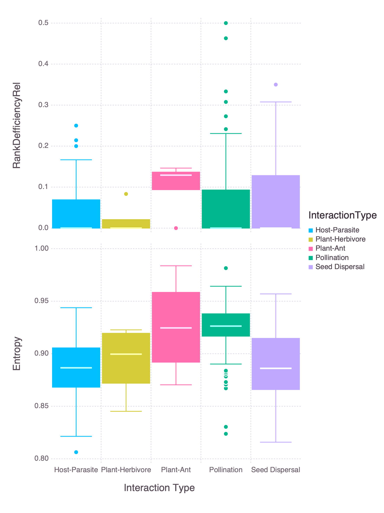
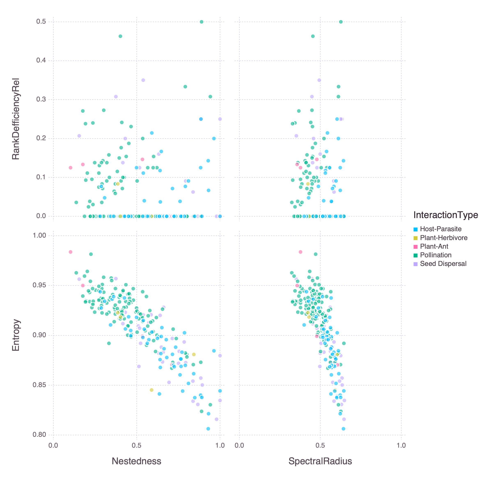
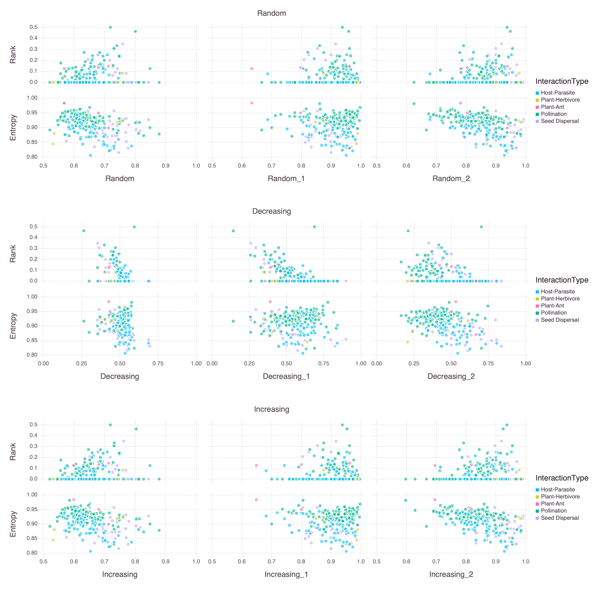

# Introduction

* The idea of entropy as 'internal complexity' and rank as 'external complexity'
* Why SVD entropy vs 'normal' entropy??
* Relationship between complexity and resilience

This is a citation: @Ginebreda2019QuaEco

# Methods

1. Networks used
 + From web of Life (maybe total # as well... split out by type??)
 + Only bipartite networks (brief description?)
 + removed those with a richness > 200
2. SVD, Entropy in particular
 + normalised

$$\overline{\lambda_{i}}=\frac{\lambda_{i}}{\Sigma_{i}\lambda_{i}}$$
 + SVD entropy (Shannon type entropy)

$$Entropy = -\frac{1}{\ln(n)}\Big\sum_{i=1}^n \overline{\lambda_{i}}\cdot\ln(\overline{\lambda_{i}})$$
3. Rank
 + Using relative rank deficiency

$$Relative rank deficiency = \frac{Rank_{max} - Rank}{Rank_{max}}$$
4. Other measures of networks
 + Compared to both entropy and relative rank deficiency
 + Something about why these measures
    + Nestedness ($\eta$)
    + Spectral radiance ($\rho$)
5. Extinctions and resilience
 + Species were removed from either the entire network or only along a single dimension i.e. a specific subset of the interacting species such as hosts or pollinators
 + Extinctions were calculated based on three 'mechanisms' by removing; 1) a random individual, 2) the most connected individual and 3) removing the least connected individual.
 + Networks were then simplified after each subsequent species removal by removing all species that no longer had any interactions until all species were removed
 + Comparing the proportion of species remaining to the proportion removed we constructed an extinction curve. Using the area under this curve following the trapezoidal rule we calculates the resilience of the network [ref?]
6. Make note of Julia packages used?
 + Is there a ~~lazy~~ smart way to do this from the manifest??
 + link to actual code?

# Results

<!--
Referring to figures:
    We can refer to +@fig:resilience
General comments RE figures:
  The axis labels still need to be 'fixed'
  Do we *really* need the legend for interaction types??? - Yes for colours though
  We could maybe merge the bee swarm (beehive?) plots with the entropy/rank vs side figures (a thought that I'll probably change in about 10 minutes time)??
  AUC fig - deffos needs some work
-->

## Rank and entropy vs. size and interaction type

{#fig:size}

{#fig:type}

## Entropy and rank

{#fig:entropy_v_rank}

Broadly Rank ≂̸ Entropy I guess...

## Rank and entropy vs. other measures of network structure

{#fig:other}

Entropy shows a relationship with other measures of network complexity ∴ it itself could act as a measure of complexity?

## Rank and entropy vs network resilience

{#fig:resilience}

# Discussion

# References
