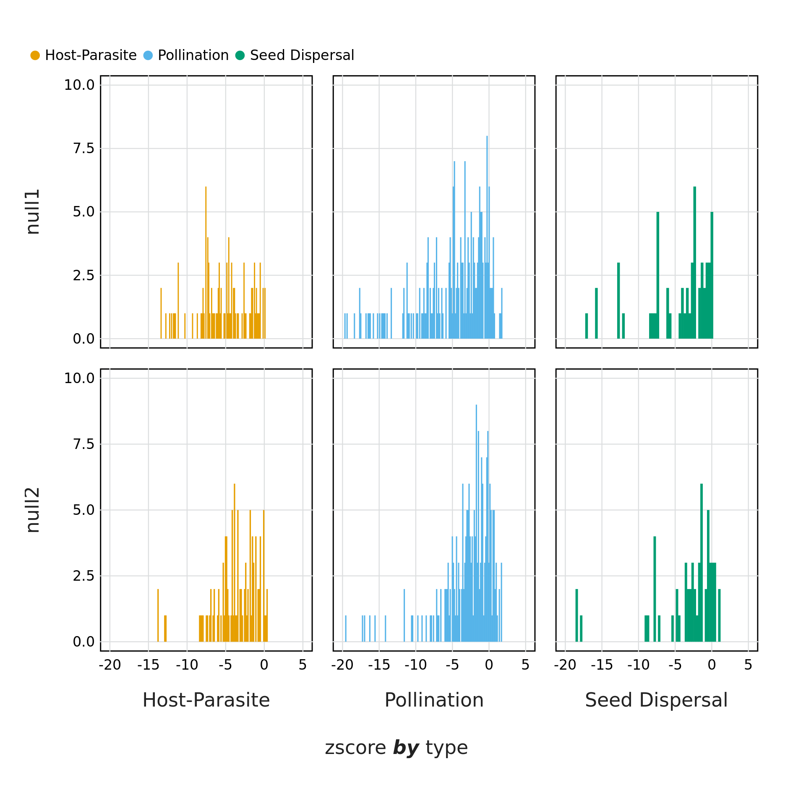
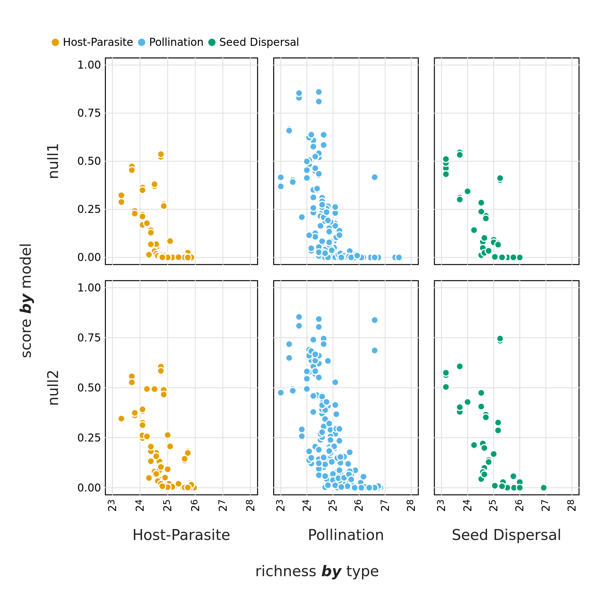

Ecologists have turned to network theory because it offers a powerful
mathematical formalism to embrace the complexity of ecological communities
[@Bascompte2007PlaMut]. Indeed, analysing ecological systems as networks
highlighted how their structure ties into ecological properties and processes
[@Proulx2005NetThi; @Poulin2010NetAna], and there has been a subsequent
explosion of measures that purport to capture elements of network structure, to
be related to the ecology of the system they describe [@Delmas2018AnaEco]. Since
the early days of network ecology, ecological networks have been called
"complex". This sustained interest for the notion of complexity stems, in part,
from the strong ties it has to stability [@Landi2018ComSta]. As such, many
authors have looked for clues, in the network structure, as to why the networks
do not collapse [@Borrelli2015SelIns; @Staniczenko2013GhoNes; @Gravel2016StaCom;
@Brose2006AllSca]. Yet decades of theoretical refinements on the relationship
between complexity and stability had a hard time when rigorously tested on
empirical datasets [@Jacquet2016NoCom]; although ecological networks may be
complex, our current measures of complexity do not translate into predictions
about stability.

Surprisingly, *complexity* itself has proven an elusive concept to define in a
rigorous way. It has over time been defined as connectance
[@Rozdilsky2001ComCan], as measures of the diversity of species or their
interactions [@Landi2018ComSta], or as a combination of species richness and
trophic diversity [@Duffy2007FunRol]. In short, network ecology as a field
readily assumes that because we have more information about a system, or because
this system has more components, or simply because this system can be expressed
as a network, it follows that the system is complex. But such a diversity of
definitions, for a concept that is so central to our quest to understand network
stability, decreases the clarity of what complexity means, and what all of these
alternative definitions do actually capture. This is a common thread in some
measures of ecological network structure, as has been discussed at length for
the various definitions of nestedness [@Ulrich2009ConSG].

None of the previous definitions of complexity are formally wrong, in that they
do capture an aspect of complexity that ultimately ties to the behaviour of the
system, *i.e.* its low predictability over time. Yet @Adami2002WhaCom provides a
compelling argument for why the complexity of the behaviour does not necessarily
reflects the complexity of the system; in fact, one would be very hard pressed
to think of a more simple system than the logistic map used by @May1976SimMat to
illustrate how easily complexity of behaviour emerges. Rather than yielding to
the easy assumption that a system will be complex because it has many parts, or
because it exhibits a complex behaviour, @Adami2002WhaCom suggests that we focus
on measuring "physical complexity", *i.e.* the amount of information required to
encode the system, and how much signal this information contains. Complex
systems, in this perspective, are those who cannot easily be compressed - and
this is a notion we can explore for the structure of ecological networks.

Ecological networks are primarily represented by their adjacency matrices,
*i.e.* a matrix in which every entry represents a pair of species, which can
take a value of 1 when the two species interact, and a value of 0 when they do
not. These matrices (as any matrices) can easily be factorised using Singular
Value Decomposition [@Forsythe1967ComSol; @Golub1971SinVal], which offers two
interesting candidate measures of complexity for ecological networks (both of
which we describe at length in the methods). The first measure is the rank of
the matrix, which works as an estimate of "external complexity", in that it
describes the dimension of the vector space of this matrix, and therefore the
number of linearly independent rows (or columns) of it. From an ecological
standpoint, this quantifies the number of unique "strategies" represented in the
network: a network with two modules that are distinct complete graphs has a rank
of 2. The second measure is an application of the entropy measure of
@Shannon1948MatThe to the non-zero singular values of the matrix obtained
through SVD. This so-called SVD entropy measures the extent to which each rank
encodes an equal amount of information, as the singular values capture the
importance of each rank to reconstruct the original matrix; this approach
therefore serves as a measure of "internal complexity".

In this manuscript, we evaluate both the rank and the SVD entropy as measures of
the complexity of ecological networks, by using a collection of 220 bipartite
networks from various types of interaction, sizes, connectances, and
environments. We show that while the rank of the adjacency matrix holds little
information, SVD entropy functions as an appropriate quantification of the
complexity of ecological systems. Notably, SVD entropy is an intuitive, robust,
non-structural approach to defining the (surprisingly high) complexity of
ecological networks, by relating them to their 'physical' as opposed to
'behavioural' complexity. In this process we showcase a breakdown in the
assumption that all measures of complexity of networks are indicative of their
robustness to extinctions. We propose that taking a physical approach to
quantifying the complexity of ecological networks is a step in the right
direction to unifying how we define complexity in the context of ecological
networks, as it restores other measures (like connectance and nestedness) to
their original role and signification.

# Data and methods

We used all bipartite networks from the `web-of-life.es` database, taken from
the `EcologicalNetworks.jl` package [@Poisot2019EcoJl] for the *Julia*
[@Bezanson2017JulFre] programming language. Using bipartite networks means that
interacting species are split into two sets (or interacting groups) and along
different dimensions in the interaction matrix. Thus, columns in the matrix
represent one group (or type) of species and rows represent the other group of
species involved in the interaction. Because SVD gives similar results on the
matrix and its transpose, it captures the complexity of both sides of the system
at once. 

## Estimating complexity with rank deficiency

The rank of $\mathbf{A}$ (noted as $r = \text{rk}(\mathbf{A})$) is the dimension
of the vector space spanned by the matrix and corresponds to the number of
linearly independent rows or columns; therefore, the maximum rank of a matrix
($M = \text{rk}_{\text{max}}(\mathbf{A})$) will always be equal to the length of
the shortest dimension of $\mathbf{A}$, which ecologically speaking is the
richness of the least species-rich compartment of the bipartite network (or the
richness in the case of unipartite networks). A matrix is "full-ranked" when
$r=M$, *i.e.* all of its rows/columns are unique. Matrices that are not
full-ranked are called rank deficient, and we can measure rank deficiency using
$d = M-r$. So as to control for the difference in species richness of the
different networks, we report the relative rank deficiency, *i.e.* expressed as
a ratio between rank deficiency and the maximal rank:

$$D = 1-\frac{r}{M}$${#eq:rankdefficiency}

This measure returns values between 0 (the matrix is full ranked) and $1-M^{-1}
\approx 1$ (the matrix has rank 1). This serves as a coarse estimate of
complexity, as the more unique columns/rows are in the matrix, the larger this
value will be. Yet it may also lack sensitivity, because it imposes a stringent
test on uniqueness, which calls for more quantitative approaches to complexity.

## Estimating complexity with SVD entropy

Singular Value Decomposition (SVD) is the factorisation of a matrix $\mathbf{A}$
(where $\mathbf{A}_{m,n} \in\mathbb{B}$ in our case, but SVD works for matrices
of real numbers as well) into the form $\mathbf{U}\cdot\mathbf{\Sigma}\cdot
\mathbf{V}^T$. $\mathbf{U}$ is an $m \times m$ orthogonal matrix and
$\mathbf{V}$ an $n \times n$ orthogonal matrix. The columns in these matrices
are, respectively, the left- and right-singular vectors of $\mathbf{A}$.
$\mathbf{\Sigma}$ is a diagonal matrix, where $\sigma_{i} = \Sigma{ii}$, which
contains the singular values of $\mathbf{A}$. When the values of
$\mathbf{\sigma}$ are arranged in descending order, the singular values are
unique, though the singular vectors may not be.

After the Eckart-Young-Mirsky theorem [@Eckart1936AppOne; @Golub1987GenEck], the
number of non-zero entries (after rounding of small values if required due to
numerical precision issues in computing the factorisation) in $\mathbf{\sigma}$
is the rank of matrix $\mathbf{A}$. For the sake of simplicity in notation, we
will use $k = \text{rk}(\mathbf{A})$) for the rank of the matrix. Because only
the first $k$ elements of $\mathbf{\sigma}$ are non-zero, and that the result of
the SVD is a simple matrix multiplication, one can define a truncated SVD
containing only the first $k$ singular values.

Intuitively, the singular value $i$ ($\sigma_i$) measures how much of the
dataset is (proportionally) explained by each vector - therefore, one can
measure the entropy of $\mathbf{\sigma}$ following @Shannon1948MatThe. High
values of SVD entropy reflects that all vectors are equally important, *i.e.*
that the structure of the ecological network cannot efficiently be compressed,
and therefore indicates high complexity [@Gu2016HowLon]. Because networks have
different dimensions, we use Pielou's evenness [@Pielou1975EcoDiv] to ensure
that values are lower than unity, and quantify SVD entropy, using
$s_i = \sigma_i/\text{sum}(\sigma)$ as:

$$J = -\frac{1}{\ln(k)}\sum_{i=1}^k s_i\cdot\ln(s_i)$${#eq:svdentropy}

# Results and discussion

## Most ecological networks are close to full-rank

The majority (63% of our dataset) of bipartite ecological networks have a
relative rank defficiency of 0 (@fig:size), which indicates that all species
have different and unique interaction lists. Interestingly, the networks that
had a comparatively larger relative rank deficiency tended to be smaller ones.
Yet because most of the networks return the same value, matrix rank does not
appear to be a useful or discriminant measure of network complexity. Another
striking result (from @fig:size) is that the SVD entropy of ecological networks
is really large -- although the value can range from 0 to 1, all ecological
networks had SVD entropy larger than 0.8, which is indicative of a strong
complexity.

{#fig:size}

As expected following the observation that ecological networks are
overwhelmingly full ranked, we do not see a relationship between SVD entropy and
relative rank deficiency, neither do we observe differences between interaction
types (@fig:entropy_v_rank). Based on these results, we feel confident that SVD
entropy provides a more informative measure of the complexity of ecological
networks, and will use it moving forward.

{#fig:entropy_v_rank}

## Most elements of network structure capture network complexity

We compared SVD entropy to some of the more common measures of complexity,
namely nestedness ($\eta$, following @Bastolla2009ArcMut), connectance
($\text{Co}$), and the spectral radius of the network ($\rho$,
following @Staniczenko2013GhoNes). All of these measures are positively
correlated, especially over the range of connectances covered by empirical
bipartite ecological networks.

The nestedness of a network is a measure of the degree of overlap between
species links (or strategies), where larger assemblages are made up of a subset
of smaller ones that share common interactions. Networks with a higher degree of
nestedness could be considered simpler when compared to networks with a lower
degree of nestedness. Connectance is the realised number of interactions (links)
in an ecological network and is calculated as the fraction of the total number
of realised interactions (or links) and the maximum number of possible
interactions in a network [@Martinez1992ConCon]. This has been shown to be a
good estimate of a community's resilience to perturbation [@Dunne2002NetStr].
The spectral radius of a matrix is the largest absolute value of its
eigenvalues, which, in addition to being presented as a measure of network
complexity has also been suggested as an indicator of the ability of a system to
dampen disturbances [@Phillips2011StrEco].

We find that SVD entropy has a clear negative relationship with nestedness,
spectral radius, and connectance (@fig:other). As in @fig:type, mutualistic
networks tend to be more complex, and they also are both sparser and less nested
than other types of networks. @Bastolla2009ArcMut give a convincing
demonstration that mutualistic networks are shaped to minimise competition --
this can be done by avoiding to duplicate overlap in interactions, thereby
resulting in a network that is close to full rank, and with high SVD entropy.
Interestingly, @fig:other suggests that both nestedness and connectance measure
the *lack* of complexity in an ecological network, which contrasts to how
they may commonly be viewed [@Landi2018ComSta].

{#fig:other}

## Complex networks are not more robust to extinction

One approach to calculating the overall structural robustness of an ecological
network is by simulating extinction events through the sequential removal of
species, which allows constructing an extinction curve that plots the
relationship between species removed and cumulative secondary extinctions
[@Dunne2002NetStr; @Memmott2004TolPol]. Extinction events can be simulated in a
manner of different ways, either by removing 1) a random individual, 2)
systematically removing the most connected species (one with the highest number
of interactions with other species) and 3) the least connected species
[@Dunne2002NetStr]. After each extinction event, we remove species from the
network that no longer have any interacting partners, thereby simulating
secondary extinctions. This is then repeated until there are no species
remaining in the network. Furthermore, we can restrict extinction events to only
one dimension of the interaction matrix, *i.e.* removing only top-level or
bottom-level species, or alternatively removing a species from any dimension of
the matrix. Extinction curves are then constructed by plotting the proportion of
species remaining against those that have been removed; it stands to reason that
a flatter curve 'maintains' its species pool for a longer number of cumulative
extinctions, and could be seen as more resilient, when compared to a curve that
has a much steeper decline. As per previous studies, we measure the robustness
to extinction as the area under the extinction curve (AUC), calculated using the
Trapezoidal rule. AUC values close to 0 means that a single extinction is enough
to collapse the network almost entirely, and values close to 1 means that most
species persist even when the number of extinctions is really high.

When looking at the relationship between SVD entropy and the area under an
extinction curve (as a proxy for resilience to extinction) we find differences
depending on both the extinction mechanism as well as along which dimension the
species removal occurred (@fig:resilience). As a whole we do not observe any
obvious relationships between SVD entropy and resilience, nor for different
interaction types. We do however see differences in the resilience of networks
depending on how the extinctions were simulated. Generally we see a higher
resilience in networks where species of only a specific group are removed or in
networks where species were either randomly removed or based on an increasing
number of interactions.

![The relationship between SVD entropy and the area under an extinction curve (as a
proxy for resilience to extinction) for both different extinction mechanisms
(Random = the removal of a random species, Decreasing = the removal of species
in order of decreasing number of interactions (i.e most to least number of
interactions), Increasing = the removal of species in order of increasing number
of interactions) as well as along different dimensions (species groups) of the
network (all = any species, 1 = only top-level species, and 2 = only bottom-
level species) Colours indicate the different interaction types of the
networks.](figures/entropy_v_AUCall.png){#fig:resilience}

As highlighted in @fig:other SVD entropy can be used as an additional measure
of network complexity. However, as shown in @fig:resilience, the assumption
that network complexity begets resilience to extinction begins to unravel when
we use a measure of physical complexity. This is in contrast to previous studies
that have shown how connectance plays a role in the resilience of networks to
extinctions [@Dunne2002NetStr; @Memmott2004TolPol]. This does not discount the
role of using *structural* measures of network complexity (*e.g.* connectance,
nestedness or spectreal radius) as indicators of their resilience (although
possibly hinting as to why there is no strong emerging consensus as to how
structural complexity relates to this), but rather points to an erroneous
assumption as to what aspects of a network we have previously used to define its
complexity.

## Plant-pollinator networks are slightly more complex

Although we don't observe clear differences in the relationship between
different interaction types when comparing amongst various measures of
complexity, we do find that different types of interaction networks have
differing SVD entropies. When comparing calculated SVD entropy between
interaction types using an ANOVA (after excluding Plant-Ant and Plant-Herbivore
interactions due to their small sample size in our dataset) we find a
significant difference between group means ($F = 47.047,  p < 10^{-3}$). A
Tukey's HSD test reveals that plant-pollinator networks ($\mu = .924$) are more
complex than both host- parasite networks ($\mu = .885, p < 10^{-3}$) and seed
dispersal ($\mu = .888, p < 10^{-3}$). Host-parasite and seed dispersal networks
had apparently no difference in average complexity ($p = .889$). These results
suggest that mutualistic networks may be more complex, which matches with
previous litterature: these networks have been shown to minimise competition
[@Bastolla2009ArcMut] and favour unique interactions, thereby increasing network
complexity. This specific structure can appear as a side-process of either
ecological [@Maynard2018NetSpa] or evolutionary [@Valverde2018ArcMut] processes,
but nevertheless leaves a profound imprint on the complexity of the networks.

{#fig:type}

## Connectance constrains complexity (but also rank deficiency)

We used simulated annealing [@Kirkpatrick1984OptSim] to generate networks with
the highest, or lowest, possible SVD entropy values. From a set network size (30
species, 15 on each side) with a random number of interactions (spanning the
entire range from minimally to maximally connected), we reorganised interactions
until the SVD entropy was as close to 0 or 1 as possible. We repeated the
process 25 times for every number of interactions. We also measured the relative
rank deficiency of the generated networks. This allows identifying the
boundaries of both measures of complexity.

By exploring the minimal and maximal values of SVD entropy for networks of a
given size, we can show that the range of complexity that a network can express
varies as a function of connectance (@fig:simann). As reported by
@Poisot2014WheEco, there is no variation when the networks are either minimally
or maximally connected, but any connectance in between can give rise to networks
of varying complexities. This being said -- minimally connected networks always
show the largest complexity, and an increase in connectance will always decrease
complexity. Interestingly, this relationship is monotonous, and there is no peak
of complexity where the maximal number of possible networks combination exists,
*i.e.* around $\text{Co} \approx 0.5$ [@Poisot2014WheEco]. This is an intriguing
result -- ecological networks are indeed extremely complex, but whereas
ecologists have usually interpreted connectance as a measure of complexity, it
is in fact sparse networks that are the complex ones, and connectance acts to
decomplexify network structure.

{#fig:simann}

The right panel of @fig:simann shows the average rank deficiency of networks for
which SVD entropy was either maximised or minimised. Complex networks (meaning,
maximally complex given their connectance) had a lower deficiency, indicating
that except at extreme connectances, there are combinations of networks for
which all species can interact in unique ways -- this is a natural consequence
of the results reported by @Poisot2014WheEco, whereby the number of possible
networks is only really constrained at the far ends of the connectance gradient.
Minimally complex networks, on the other hand, saw their rank deficiency
increase with connectance. This hints at the fact that the decrease in
complexity with connectance may be primarily driven by the infeasibility of
having enough species for them to all interact uniquely as connectance
increases. Because non-unique interactions tend to result in competition
[@Bascompte2007PlaMut], this can "push" networks towards the full-rank
configuration (as suggested by the results in @fig:size), thereby maximising
complexity regardless of connectance.

## Larger networks are less complex than they could be

To assess whether ecological networks are more, or less, complex than expected,
we applied two null models that generate pseudo-random networks: Type I
[@Fortuna2006HabLos], where interactions happen proportionally to connectance,
and Type II [@Bascompte2003NesAss], where interactions happen proportionally to
the joint degree of the two species involve. The models are equivalent to,
respectively, the Erdos-Renyi and Configuration models [@Newman2010NetInt], both
of which are maximum entropy generative models that reflfect global (Type I) or
local (Type II) constraints [@Park2004StaMec]. We generated 999 samples for
every network in the dataset, and measured the *z*-score of the empirical
network as

$$z_i = \frac{x_i-\mu_i}{\sigma_i}$${#eq:zscore}

where $x_i$ is the SVD entropy of network $i$, and $\mu_i$ and $\sigma_i$ are
respectively the average and standard deviation of the distribution of SVD
entropy under the null model. Negative values of $z_i$ reflect a network that
has lower entropy than expected under the assumptions of the null model. In
@fig:nullmod, we show that despite high *absolute* values of SVD entropy,
ecological networks are not as complex as they *can* be. This is consistently
true for both null models, and for the three types of networks that had a
sufficient sample size.

{#fig:nullmod}

Previous work on random networks (using a model that is essentially the Type I
null model) shows that sufficiently large networks achieve maximal von Neuman
entropy [@Du2010NotNeu; @Passerini2011NeuEnt]. In @fig:larger, we compare the
*logistic* of $z_i$ to the richness of the network. Transforming to the logistic
smoothes out differences in absolute value that are apparent in @fig:nullmod,
and projects the values in the unit range, with values above $0.5$ being more
complex than expected. It is quite obvious that, across both models and the
three types of interactions, only smaller networks achieve higher entropy.
@Barbier2018GenAss and @Saravia2018EcoNet have previously noted that the early
stages of network assembly usually result in severely constrained networks, due
to the conditions required for multiple species to persist; as networks grow
larger, these constraints may "relax", leading in networks with more redundancy,
and therefore a lower complexity.

{#fig:larger}

# Conclusion

We present SVD entropy as a starting point to unifying (and standardising) how
we should approach defining the complexity of ecological networks. The use of a
unified definition will allow us to revisit how complexity relates to the
ecological properties of networks using a standardised method, or further
exploring why, despite the strong relationship between the physical and
behavioural complexity of networks, they seem to be underpinning different
aspects of network properties. One important result from using SVD entropy is
that the complexity of ecological networks is indeed *immense*. However, we 
find that ecological networks are not *as* complex as what they could be, especially 
when looking at larger networks. We suggest that this might be related to the assembly 
dynamics of networks but this still raises the question as to why larger (or more mature) 
networks are not 'maintaining' this expected or potential complexity.

# References
