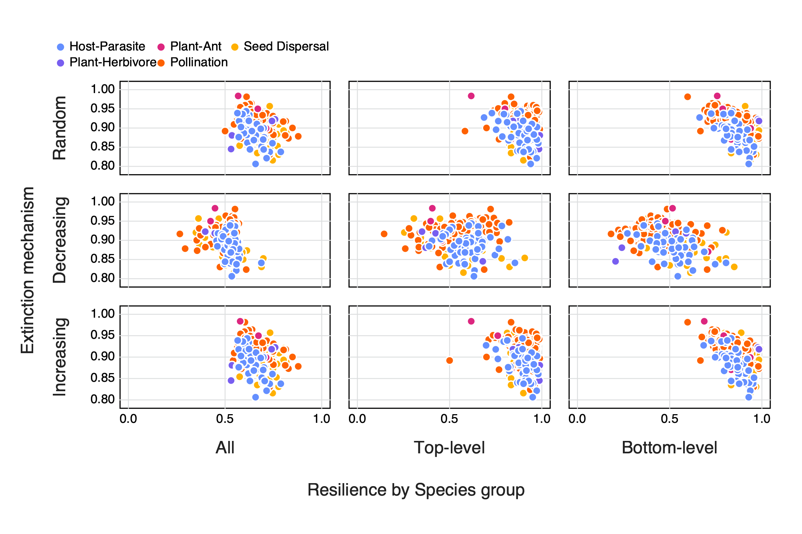

# Introduction

* The idea of entropy as 'internal complexity' and rank as 'external complexity'
* Why SVD entropy vs 'normal' entropy??
* Relationship between complexity and resilience

This is a citation: @Ginebreda2019QuaEco

# Methods

1. Networks used
 + From web of Life (maybe total # as well... split out by type??)
 + Only bipartite networks (brief description?)
 + removed those with a richness > 200

## Singular Value Decomposition of an interaction network

Broadly Singular Value Decomposition (SVD) is the factorisation of a matrix *M* (where $M_{m,n} \in\mathbb{R}$) into the form $U\cdot\Sigma\cdot V^T$. Where *U* is an $m \times m$ unitary matrix and *V* an $n \times n$ unitary matrix. The columns of *U* and of *V* are called the left- and right-singular vectors of *M* respectively. $\Sigma$ is made up of diagonal entries $\sigma_{i} = \Sigma{ii}$ and are known as singular values of *M* and can be arranged to be descending, where the number on non-zero values are equal to the rank of the matrix or in this case ecological network.

The singular values of $\Sigma$ can be used to define the complexity of a network, using a 'Shannon type entropy' approach. First we can arrange the set of singular values $(\sigma_{i})_{i=1,n}$ to be descending and normalise them (See @eq:1), where $\Sigma_{i}\overline{\sigma_{i}} = 1$

$$\overline{\sigma_{i}}=\frac{\sigma_{i}}{\Sigma_{i}\sigma_{i}}$${#eq:1}

Following this the SVD Entropy can bee calculated (see @eq:2), so as to control for networks of different sizes we can once again control for this by dividing by $\ln(n)$, where *n* is the number of non-zero $\sigma$ values.

$$SVD Entropy = -\frac{1}{\ln(n)}\Big\sum_{i=1}^n \overline{\sigma_{i}}\cdot\ln(\overline{\sigma_{i}})$${#eq:2}

## The rank of ecological networks

The rank of of matrix *M* (denoted as $rk(M)$) is the dimension of the vector space spanned by the matrix and corresponds to the number of linearly independent rows or columns. In terms of networks this would translate to the number of unique interaction combinations. <!---don't think this is the best possible phrasing--> The maximum rank of a matrix ($rk_{max}(M)$) will always be equal the the length of the shortest dimension of matrix *M*. Using the maximum rank of a matrix we can determine if a matrix is rank deficient by calculating the relative rank deficiency by subtracting the actual rank of a matrix from its maximum rank (@eq:3), so as to control for matrices of different sizes we can divide this by $rk_{max}(M)$ to constrain values between 0 and 1

$$Relative rank deficiency = \frac{rk_{max}(M) - rk(M)}{rk_{max}(M)}$${#eq:3}

[Some notes on linking back to networks/ecology - why rank def not just rank?]

Where to bring in comparing rank to SVD entropy

## Comparing rank and entropy to other measures of network architecture

In addition, we compared both relative rank deficiency and SVD entropy to other measures of network architecture, namely nestedness ($\eta (M)$) and spectral radius ($\rho (M)$). The nestedness of a network is a measure of the degree of overlap between species links, where larger assemblages are made up of a subset of smaller ones that share common interactions. <!--- nestedness was calculated from {EcologicalNetworks} which follows @bast09amn - should we write out the fancy maths or is it enough to link? ---> The spectral radius of a matrix is the largest absolute value of its eigenvalues.

4. Other measures of networks
 + Compared to both entropy and relative rank deficiency
 + Something about why these measures
    + Nestedness ($\eta$)
    + Spectral radius ($\rho$)

## Simulating extinctions and estimating resilience in ecological networks

[need 1/2 intro points on extinction, resilience and maybe how this links to complexity to set the scene - also a part of me really wants to do a rough schematic here for some reason...] Extinctions were calculated based on three 'mechanisms', either by removing 1) a random individual, 2) the most connected species (one with the highest number of interactions with other species) and 3) removing the least connected species (the species with the least number of interactions). If there were multiple species with the same number of interactions a random individual was removed. After the removal of a species the network was simplified be removing species that no longer had any interacting partners - i.e. became extinct. This was repeated until all species were removed from the network. This was repeated for each network along both dimensions<!--- is this the correct phrasing? --->, whereby any species that met the removal criteria were removed, as well as for species along only one dimension i.e. for a specific group of species such as parasites or pollinators. From here we compared the proportion of species remaining to the proportion removed with each subsequent extinction event to construct an extinction curve for each network. Following the trapezoidal rule<!---should we expand on this or is it okay to just 'name drop'? ---> we then calculated the area under an extinction curve as a measure of the resilience of the network [ref?]

6. Make note of Julia packages used?
 + Is there a ~~lazy~~ smart way to do this from the manifest??

# Results

<!--
Referring to figures:
    We can refer to +@fig:resilience
General comments RE figures:
  The axis labels still need to be 'fixed'
  Do we *really* need the legend for interaction types??? - Yes for colours though
  We could maybe merge the bee swarm (beehive?) plots with the entropy/rank vs side figures (a thought that I'll probably change in about 10 minutes time)??
  AUC fig - deffos needs some work
-->

## Rank and entropy vs. size and interaction type

- networks with more species have low rank deficiency but high entropy, and there is no obiovus difference between interaction types

{#fig:size}

- there is no obvious relationship between rank and entropy, and it is not different across interaction types, this is because a lot of networks are actually full rank

{#fig:entropy_v_rank}

- QUESTION: what is the proportion of networks that are full rank? no need for a figure, but you can give the values in the text

{#fig:type}

- change fig:type to only show entropy - comment on the fact entropy values are quite high

## Rank and entropy vs. other measures of network structure

{#fig:other}

Entropy shows a relationship with other measures of network complexity ∴ it itself could act as a measure of complexity?

## Rank and entropy vs network resilience

{#fig:resilience}

# Discussion

* Nestedness ≈ to spectral radius (Staniczenko 2013) ∴ expect similar relationship for these measures with either rank or entropy
* Phillips (2011) argues that spectral radius ≈ ability of system to dampen/absorb perturbations ∴ resilience?

# References
