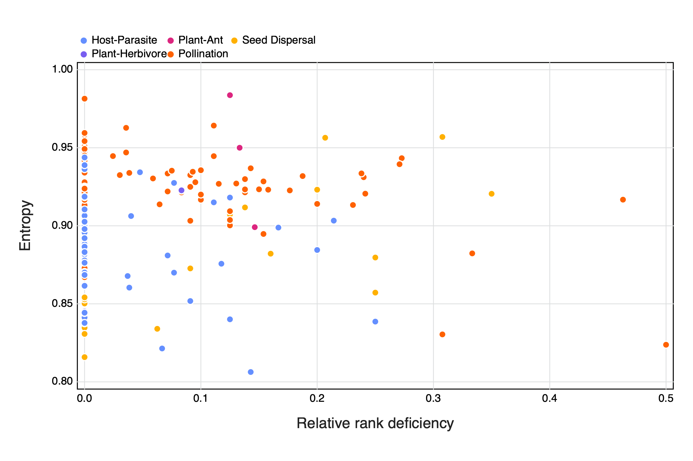

*Potential title ideas*

* Using SVD and entropy provides a robust measure of the complexity of ecological networks (*this does not refer to stability/resilience though*)
* Understanding the complexity and stability of ecological networks using SVD and information theory (*simple but not informative*)
* Entropy and information theory as an approach to understanding the complexity and stability of ecological networks (*better but maybe still a bit 'vague'...*)
* Entropy and information theory provides an informative approach to understanding the complexity of ecological networks, but not stability (*maybe a bit more directive/results-y BUT does it play it down?*)
* The complexity of ecological networks are more than the sum of their parts: Using entropy and information theory

# Introduction

Ecologists have turned to ecological networks as a mathematical formalism to
embrace the complexity of ecological communities [@Bascompte2007PlaMut]. Indeed,
analysing ecological systems as networks has highlighted how their structure
ties into ecological properties and processes [@Proulx2005NetThi;
@Poulin2010NetAna], and there have been an explosion of measures that purport to
capture elements of network structure that relate to the ecology of the system
they describe [@Delmas2018AnaEco].

**TODO** short discussion of the fact that complexity is super important in the stability debate

And yet, *complexity* itself has proven an elusive concept to define in a
rigorous way. It has over time been defined as connectance
[@Rozdilsky2001ComCan], as measures of the diversity of species or their
interactions [@Landi2018ComSta], or as a combination of species richness and
trophic diversity [@Duffy2007FunRol]. In short, network ecology as a field
readily assumes that because we have more information about a system, or because
this system has more components, it follows that the system becomes *more
complex*.

None of these definitions are formally wrong, in that they capture an aspect of
complexity that ties to the behaviour of the system, *i.e.* its low
predictability. Yet @Adami2002WhaCom provides a compelling argument for why the
complexity of the behaviour does not necessarily reflect the complexity of the
system; in fact, one would be very hard pressed to think of a more simple system
than the logistic map used by @May1976SimMat to illustrate how readily
complexity of behaviour emerges. Rather than yielding to the easy assumption that
a system will be complex because it has many parts, or because it exhibits a
complex behaviour, @Adami2002WhaCom suggests that we focus on measuring "physical
complexity", *i.e.* the amount of information required to encode the system, and
how much signal this information contains.

Ecological networks are primarily represented by their adjacency matrices,
*i.e.* a matrix in which every entry represents a pair of species, which can
take a value of 1 when the two species interact, and a value of 0 when they do
not. These matrices (as any matrices) can easily be factorised using Singular
Value Decomposition [@Forsythe1967ComSol; @Golub1971SinVal], which offers two
interesting candidate measures of complexity for ecological networks (both of
which we describe at length in the methods). The first measure is the rank of
the matrix, which works as an estimate of "external complexity", in that it
describes the dimension of the vector space of this matrix, and therefore the
number of linearly independent rows (or columns) of it. From an ecological
standpoint, this quantifies the number of unique "strategies" represented in the
network: a network with two modules that are complete and disconnected from one
another has a rank of 2. The second measure is an application of the entropy
measure of @Shannon1948MatThe to the singular value of the matrix obtained
through SVD. This so-called SVD entropy measures the extent to which each rank
encodes an equal amount of information, as the singular values capture the
importance of each rank in giving the entire matrix; this approach therefore
serves as a measure of "internal complexity".

In this manuscript, we evaluate both the rank and the SVD entropy as measures of
the complexity of ecological networks, by using a collection of 220 bipartite
networks from various types of interaction, sizes, connectances, and
environments. We show that while the rank of the adjacency matrix holds little
information, SVD entropy functions as an appropriate quantification of the
complexity of ecological systems. Notably, we ***need a summary of the results
here***.

# Methods

We used all bipartite networks from the `web-of-life.es` database, taken from
the `EcologicalNetworks.jl` package [@Poisot2019EcoJl] for the *Julia*
[@Bezanson2017JulFre] programming language. Using bipartite networks means that
interacting species are split into two sets (or interacting groups) and along
different dimensions in the interaction matrix. Thus, columns in the matrix
represent one group (or type) of species and rows represent the other group of
species involved in the interaction.

## Estimating complexity with rank deficiency

The rank of $\mathbf{A}$ (noted as $r = \text{rk}(\mathbf{A})$) is the dimension
of the vector space spanned by the matrix and corresponds to the number of
linearly independent rows or columns; therefore, the maximum rank of a matrix
($M = \text{rk}_{\tetx{max}}(\mathbf{A})$) will always be equal to the length of
the shortest dimension of $\mathbf{A}$, which ecologically speaking is the
richness of the least species-rich compartment of the bipartite network (or the
richness in the case of unipartite networks). A matrix is "full-ranked" when
$r=M$, *i.e.* all of its rows/columns are unique. Matrices that are not
full-ranked are called rank deficient, and we can measure rank deficiency using
$d = M-r$. So as to control for the difference in species richness of the different networks, we report the relative rank deficiency, *i.e.* expressed as a ratio between rank deficiency and the maximal rank:

$$D = 1-\frac{r}{M}$${#eq:rankdefficiency}$$

This measure returns values between 0 (the matrix is full ranked) and $1-M^{-1}$
(the matrix has rank 1). This serves as a coarse estimate of complexity, as the
more unique columns/rows are in the matrix, the larger this value will be. Yet
it may also lack sensitivity, because it imposes a stringent test on uniqueness,
which calls for more quantitative approaches to complexity.

## Estimating complexity with SVD entropy

Singular Value Decomposition (SVD) is the factorisation of a matrix $\mathbf{A}$
(where $\mathbf{A}_{m,n} \in\mathbb{B}$ in our case, but SVD works for matrices
of real numbers as well) into the form $\mathbf{U}\cdot\mathbf{\Sigma}\cdot
\mathbf{V}^T$. $\mathbf{U}$ is an $m \times m$ orthogonal matrix and
$\mathbf{V}$ an $n \times n$ orthogonal matrix. The columns in these matrices
are, respectively, the left- and right-singular vectors of $\mathbf{A}$.
$\mathbf{\Sigma}$ is a diagonal matrix, where $\sigma_{i} = \Sigma{ii}$, which
contains the singular values of $\mathbf{A}$. When the values of
$\mathbf{\sigma}$ are arranged in descending order, the singular values are
unique, though the singular vectors may not be.

After the Eckart-Young-Mirsky theorem [@Eckart1936AppOne; @Golub1987GenEck], the
number of non-zero entries (after rounding of small values if required due to
numerical precision issues in computing the factorisation) in $\mathbf{\sigma}$
is the rank of matrix $\mathbf{A}$. For the sake of simplicity in notation, we
will use $k = \text{rk}(\mathbf{A})$) for the rank of the matrix. Because only
the first $k$ elements of $\mathbf{\sigma}$ are non-zero, and that the result of
the SVD is a simple matrix multiplication, one can define a truncated SVD
containing only the first $k$ singular values.

Intuitively, the singular value $i$ ($\sigma_i$) measures how much of the
dataset is (proportionally) explained by each vector - therefore, one can
measure the entropy of $\mathbf{\sigma}$ following @Shannon1948MatThe. A SVD
with high values reflects that all vectors are equally important, *i.e.* that
the structure of the ecological network cannot efficiently be compressed, and
therefore indicates high complexity [@Gu2016HowLon]. Because networks have
different dimensions, we use Pielou's evenness [@Pielou1975EcoDiv] to ensure
that values are lower than unity, and quantify SVD entropy, using $s_i =
\sigma_i/\sum \sigma$ as

$$J = -\frac{1}{\ln(k)}\Big\sum_{i=1}^k s_i\cdot\ln(s_i)$${#eq:svdentropy}

## Comparing measures of complexity and network size

In an effort to better understand the 'performance' of these physical measures of complexity we can start by comparing both relative rank deficiency and SVD entropy to the species richness of networks *i.e.* the network size. This was followed by comparing the SVD entropy of a network to its relative rank deficiency, *i.e* determining if using the rank of a network is sufficient in capturing its complexity.

## Comparing entropy to other measures of network complexity

We then compared the relationship of SVD entropy to other measures of network complexity, namely nestedness ($\mathit{\eta}$) and spectral radius ($\mathit{\rho$}) and connectance ($\mathit{Co}$). The nestedness of a network is a measure of the degree of overlap between species links, where larger assemblages are made up of a subset of smaller ones that share common interactions. Networks with a higher degree of nestedness could be considered less 'complex' than when compared to networks with a higer degree of nestedness. <!--- nestedness was calculated from {EcologicalNetworks} which follows @Bastolla2009ArcMut - should we write out the fancy maths or is it enough to link? ---> The spectral radius of a matrix is the largest absolute value of its eigenvalues, which is another measure of network complexity and can be used as an indicator of the abilituy of a system to dampen disturbances @Phillips2011StrEco. Connectance is calculated as the fraction of the total number of realised interactions (or links) and the maximum number of possible interactions in a network @Martinez1992ConCon. This has been shown to be a good estimate of community resilience to disturbance [@Dunne2002NetStr].

## Assessing stability through targeted removal of species

One approach to calculating the stability of an ecological network is by simulating extinction events through the sequential removal of species, this is then followed by constructing an extinction curve that plots the relationship between species removed and cumulative, secondary extinctions [@Dunne2002NetStr; @Memmott2004TolPol]. Extinction events can be simulated in a manner of different ways, either by removing 1) a random individual, 2) systematically removing the most connected species (one with the highest number of interactions with other species) and 3) the least connected species [@Dunne2002NetStr]. After each extinction event we can remove species from the network that no longer have any interacting partners *i.e.* simulating secondary extinctions. This is then repeated until there are no species remaining in the network. Furthermore, we can restrict extinction events to only one dimension of the interaction matrix, *i.e.* removing only row or column species, or alternatively removing a species from any dimension of the matrix - provided they meet the extinction criteria outlined above. Extinction curves are then constructed by plotting the proportion of remaining species against those that have been removed, which can arguably be viewed as the proportion of species remaining as a function of time. If we implement this thinking then it stands to reason that a flatter curve 'maintains' its species pool for a longer time period and could be seen as more stable than when compared to a curve that has a much steeper decline. Arguably we can then relate the stability of an ecological network to the area under its extinction curve, which we can estimate using the trapezoidal rule.

* Make note of Julia packages used?
 + Is there a ~~lazy~~ smart way to do this from the manifest??

# Results

## Network size is not a great measure complexity, and neither is rank

**COMMENT** The 'flow' of this section feels odd at times.. on the one hand I want flip the order so that it goes 1) heres a brief summary of entropy and network type, 2) Here is internal vs external complexity and 3) comparing to network size one of the coarser measures of complexity -> which then moves onto the other measures of complexity section BUT the current order also works as it allows us to 'exclude' rank as we show it isn't the ideal/best measure.

Networks that have a higher species richness (size) tend to have a lower rank deficiency and a higher entropy, with no obvious differences between networks of different interaction types (see fig. @fig:size).

{#fig:size}

We do not see an obvious relationship between entropy and relative rank
deficiency or differences between interaction types (fig. @fig:entropy_v_rank),
this is because a large proportion (0.63) of the networks are full rank.

{#fig:entropy_v_rank}

Upon closer inspection we find that the entropy values of networks are quite
high (between 0.8 - 1) and no obvious difference between interaction types, but
some variation within the different interaction types <!--- although this last
phrase might not be the 'best' as there is some 'clustering' for pollination
networks... ---> (fig. @fig:type)

{#fig:type}

## SVD entropy can preform as a measure of complexity

We find that entropy appears to have a negative relationship with both
nestedness and spectral radius, with no clear differences between the types of
interactions (fig. @fig:other).

{#fig:other} <!--- when I one day figure out how to do idiv plot labels -->

## The stability of a network is more than its complexity

<!---⬆ I really want to say that network stability is more than the sum of its parts... --->

When looking at the relationship between entropy and the area under an
extinction curve (as a proxy for resilience to extinction) we find differences
depending on both the extinction mechanism as well as along which dimension the
species removal occurred (fig @fig:resilience). As a whole we do not observe any
obvious relationships between entropy and resilience, nor for different
interaction types. We do however see differences in the resilience of networks
depending on how the extinctions were simulated. Generally we see a higher
resilience in networks where species of only a specific group are removed or in
networks where species were either randomly removed or based on an increasing
number of interactions.

![The relationship between entropy and the area under an extinction curve (as a proxy for resilience to extinction) for both different extinction mechanisms (Random = the removal of a random species, Decreasing = the removal of species in order of decreasing number of interactions (i.e most to least number of interactions), Increasing = the removal of species in order of increasing number of interactions) as well as along different dimensions (species groups) of the network (all = any species, 1 = only top-level species, and 2 = only bottom-level species) Colours indicate the different interaction types of the networks.](figures/entropy_v_AUCall.png){#fig:resilience}

# Discussion

* Coarse network measures (rank & size) are not sufficient in capturing the complexity of a networks i.e. bigger is not going to be better where complexity is concerned and as a measure should be discarded
* Regarding SVD entropy as a complexity measure we see it 'plays well' with the other 'traditional' measures and is arguably a more 'true' measure of complexity than looking at structural (behavioural) elements of networks. We should use it!
* The complexity does not beget stability discussion...

# References
