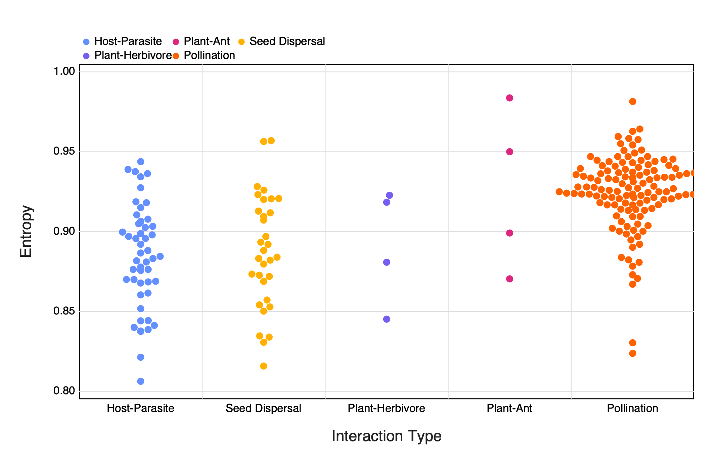
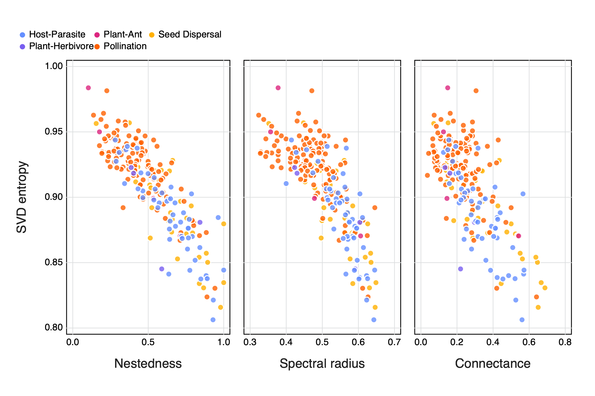

# Introduction

* The idea of entropy as 'internal complexity' and rank as 'external complexity'
* Why SVD entropy vs 'normal' entropy??
* Relationship between complexity and resilience

This is a citation: @Ginebreda2019QuaEco

# Methods

1. Networks used
 + From web of Life (maybe total # as well... split out by type??)
 + Only bipartite networks (brief description?)
 + removed those with a richness > 200

## Singular Value Decomposition of an interaction network

Broadly Singular Value Decomposition (SVD) is the factorisation of a matrix *M* (where $M_{m,n} \in\mathbb{R}$) into the form $U\cdot\Sigma\cdot V^T$. Where *U* is an $m \times m$ unitary matrix and *V* an $n \times n$ unitary matrix. The columns of *U* and of *V* are called the left- and right-singular vectors of *M* respectively. $\Sigma$ is made up of diagonal entries $\sigma_{i} = \Sigma{ii}$ and are known as singular values of *M* and can be arranged to be descending, where the number on non-zero values are equal to the rank of the matrix or in this case ecological network.

The singular values of $\Sigma$ can be used to define the complexity of a network, using a 'Shannon type entropy' approach. First we can arrange the set of singular values $(\sigma_{i})_{i=1,n}$ to be descending and normalise them (See @eq:1), where $\Sigma_{i}\overline{\sigma_{i}} = 1$

$$\overline{\sigma_{i}}=\frac{\sigma_{i}}{\Sigma_{i}\sigma_{i}}$${#eq:1}

Following this the SVD Entropy can bee calculated (see @eq:2), so as to control for networks of different sizes we can once again control for this by dividing by $\ln(n)$, where *n* is the number of non-zero $\sigma$ values.

$$SVD Entropy = -\frac{1}{\ln(n)}\Big\sum_{i=1}^n \overline{\sigma_{i}}\cdot\ln(\overline{\sigma_{i}})$${#eq:2}

## The rank of ecological networks

The rank of of matrix *M* (denoted as $rk(M)$) is the dimension of the vector space spanned by the matrix and corresponds to the number of linearly independent rows or columns. In terms of networks this would translate to the number of unique interaction combinations. <!---don't think this is the best possible phrasing--> The maximum rank of a matrix ($rk_{max}(M)$) will always be equal the the length of the shortest dimension of matrix *M*. Using the maximum rank of a matrix we can determine if a matrix is rank deficient by calculating the relative rank deficiency by subtracting the actual rank of a matrix from its maximum rank (@eq:3), so as to control for matrices of different sizes we can divide this by $rk_{max}(M)$ to constrain values between 0 and 1

$$Relative rank deficiency = \frac{rk_{max}(M) - rk(M)}{rk_{max}(M)}$${#eq:3}

[Some notes on linking back to networks/ecology - why rank def not just rank?]

Where to bring in comparing rank to SVD entropy

## Comparing rank and entropy to other measures of network architecture

In addition, we compared both relative rank deficiency and SVD entropy to other measures of network architecture, namely nestedness ($\eta (M)$) and spectral radius ($\rho (M)$). The nestedness of a network is a measure of the degree of overlap between species links, where larger assemblages are made up of a subset of smaller ones that share common interactions. <!--- nestedness was calculated from {EcologicalNetworks} which follows @bast09amn - should we write out the fancy maths or is it enough to link? ---> The spectral radius of a matrix is the largest absolute value of its eigenvalues.

4. Other measures of networks
 + Compared to both entropy and relative rank deficiency
 + Something about why these measures
    + Nestedness ($\eta$)
    + Spectral radius ($\rho$)

## Simulating extinctions and estimating resilience in ecological networks

[need 1/2 intro points on extinction, resilience and maybe how this links to complexity to set the scene - also a part of me really wants to do a rough schematic here for some reason...] Extinctions were calculated based on three 'mechanisms', either by removing 1) a random individual, 2) the most connected species (one with the highest number of interactions with other species) and 3) removing the least connected species (the species with the least number of interactions). If there were multiple species with the same number of interactions a random individual was removed. After the removal of a species the network was simplified be removing species that no longer had any interacting partners - i.e. became extinct. This was repeated until all species were removed from the network. This was repeated for each network along both dimensions<!--- is this the correct phrasing? --->, whereby any species that met the removal criteria were removed, as well as for species along only one dimension i.e. for a specific group of species such as parasites or pollinators. From here we compared the proportion of species remaining to the proportion removed with each subsequent extinction event to construct an extinction curve for each network. Following the trapezoidal rule<!---should we expand on this or is it okay to just 'name drop'? ---> we then calculated the area under an extinction curve as a measure of the resilience of the network [ref?]

6. Make note of Julia packages used?
 + Is there a ~~lazy~~ smart way to do this from the manifest??

# Results

<!--
Referring to figures:
    We can refer to +@fig:resilience
General comments RE figures:
  The axis labels still need to be 'fixed'
  Do we *really* need the legend for interaction types??? - Yes for colours though
-->

## Rank and entropy vs. size and interaction type

We sampled a total of 220 bipartite interaction networks from the Web of Life database. Different interaction types of the networks included pollination (n = 129), host-parasite (n = 51), seed dispersal (n = 32), plant-herbivore (n = 4), and plant-ant (n = 4) interactions. Networks that have a higher species richness (size) tend to have a lower rank deficiency and a higher entropy, with no obvious differences between networks of different interaction types (see @fig:size).

{#fig:size}

We do not see an obvious relationship between entropy and relative rank deficiency or differences between interaction types (@fig:entropy_v_rank), this is because a large proportion (0.63) of the networks are full rank.

{#fig:entropy_v_rank}

Upon closer inspection we find that the entropy values of networks are quite high (between 0.8 - 1) and no obvious difference between interaction types, but some variation within the different interaction types <!--- although this last phrase might not be the 'best' as there is some 'clustering' for pollination networks... ---> (+@fig:type)

{#fig:type}

## Rank and entropy vs. other measures of network architecture

We find that entropy appears to have a negative relationship with both nestedness and spectral radius, with no clear differences between the types of interactions (+@fig:other).

{#fig:other} <!--- when I one day figure out how to do idiv plot labels -->

## Rank and entropy vs network resilience

When looking at the relationship between entropy and the area under an extinction curve (as a proxy for resilience to extinction) we find differences depending on both the extinction mechanism as well as along which dimension the species removal occurred (+@fig:resilience). As a whole we do not observe any obvious relationships between entropy and resilience, nor for different interaction types. We do however see differences in the resilience of networks depending on how the extinctions were simulated. Generally we see a higher resilience in networks where species of only a specific group are removed or in networks where species were either randomly removed or based on an increasing number of interactions.

![The relationship between entropy and the area under an extinction curve (as a proxy for resilience to extinction) for both different extinction mechanisms (Random = the removal of a random species, Decreasing = the removal of species in order of decreasing number of interactions (i.e most to least number of interactions), Increasing = the removal of species in order of increasing number of interactions) as well as along different dimensions (species groups) of the network (all = any species, 1 = only top-level species, and 2 = only bottom-level species) Colours indicate the different interaction types of the networks.](figures/entropy_v_AUCall.png){#fig:resilience}

# Discussion

* Nestedness ≈ to spectral radius (Staniczenko 2013) ∴ expect similar relationship for these measures with either rank or entropy
* Phillips (2011) argues that spectral radius ≈ ability of system to dampen/absorb perturbations ∴ resilience?

# References
