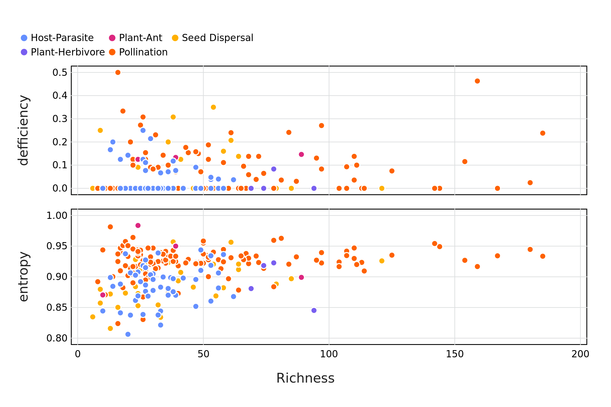

# Introduction

* The idea of entropy as 'internal complexity' and rank as 'external complexity'
* Why SVD entropy vs 'normal' entropy??
* Relationship between complexity and resilience

This is a citation: @Ginebreda2019QuaEco

# Methods

1. Networks used
 + From web of Life (maybe total # as well... split out by type??)
 + Only bipartite networks (brief description?)
 + removed those with a richness > 200
2. SVD; Entropy in particular

## Singular Value Decomposition of an interaction network

Broadly Singular Value Decomposition (SVD) is the factorisation of a matrix *M* (where $M_{m,n} \in\mathbb{R}$) into the form $U\cdot\Sigma\cdotV^T$. Where *U* is an $m \times m$ unitary matrix and *V* an $n \times n$ unitary matrix. The columns of *U* and of *V* are called the left- and right-singular vectors of *M* respectively. $Σ$ is made up of diagonal entries $\sigma_{i} = \Sigma{ii}$ and are known as singular values of *M* and can be arranged to be descending, where the number on non-zero values are equal to the rank of the matrix or in this case ecological network.

The singular values of $\Sigma$ can be used to define the complexity of a network, using a Shannon type entropy' approach. First we can arrange the set of singular values $(\sigma_{i})_{i=1,n}$ to be descending and normalise them (See +@eq:1), where $\Sigma_{i}\overline{\sigma_{i}} = 1$

$$\overline{\sigma_{i}}=\frac{\sigma_{i}}{\Sigma_{i}\sigma_{i}}$${#eq:1}

Following this the SVD Entropy can bee calculated (see +@eq:2), so as to control for networks of different sizes we can once again control for this by dividing by $\ln(n)$, where *n* is the number of non-zero $σ$ values.

$$SVD Entropy = -\frac{1}{\ln(n)}\Big\sum_{i=1}^n \overline{\sigma_{i}}\cdot\ln(\overline{\sigma_{i}})$${#eq:2}

## Ranks of ecological networks

3. Rank
 + Using relative rank deficiency

$$Relative rank deficiency = \frac{Rank_{max} - Rank}{Rank_{max}}$$

## Comparing rank and entropy to other measures of network complexity

4. Other measures of networks
 + Compared to both entropy and relative rank deficiency
 + Something about why these measures
    + Nestedness ($\eta$)
    + Spectral radiance ($\rho$)

## Simulating extinctions and estimating resilience in ecological networks

[need 1/2 intro points on extinction, resilience and maybe how this links to complexity to set the scene - also a part of me really wants to do a rough schematic here for some reason...] Extinctions were calculated based on three 'mechanisms', either by removing 1) a random individual, 2) the most connected species (one with the highest number of interactions with other species) and 3) removing the least connected species (the species with the least number of interactions). If there were multiple species with the same number of interactions a random individual was removed. After the removal of a species the network was simplified be removing species that no longer had any interacting partners - i.e. became extinct. This was repeated until all species were removed from the network. This was repeated for each network along both dimensions<!--- is this the correct phrasing? --->, whereby any species that met the removal criteria were removed, as well as for species along only one dimension i.e. for a specific group of species such as parasites or pollinators. From here compared the proportion of species remaining to the proportion removed with each subsequent extinction event to construct an extinction curve for each network. Following the trapezoidal rule we then calculated the area under an extinction curve as a measure of the resilience of the network [ref?]

6. Make note of Julia packages used?
 + Is there a ~~lazy~~ smart way to do this from the manifest??
 + link to actual code?

# Results

<!--
Referring to figures:
    We can refer to +@fig:resilience
General comments RE figures:
  The axis labels still need to be 'fixed'
  Do we *really* need the legend for interaction types??? - Yes for colours though
  We could maybe merge the bee swarm (beehive?) plots with the entropy/rank vs side figures (a thought that I'll probably change in about 10 minutes time)??
  AUC fig - deffos needs some work
-->

## Rank and entropy vs. size and interaction type

{#fig:size}

{#fig:type}

## Entropy and rank

{#fig:entropy_v_rank}

Broadly Rank ≂̸ Entropy I guess...

## Rank and entropy vs. other measures of network structure

{#fig:other}

Entropy shows a relationship with other measures of network complexity ∴ it itself could act as a measure of complexity?

## Rank and entropy vs network resilience

{#fig:resilience}

# Discussion

# References
